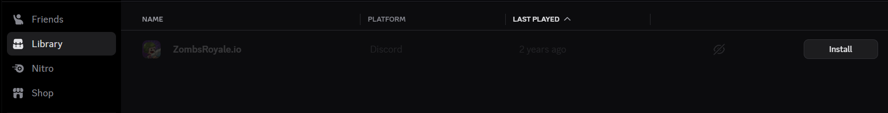

## History

ZombsRoyale is a game whose PC client version used to be installed officially through Discord Game Library from [here](https://discord.com/store/skus/519338998791929866/zombsroyale-io) (link is down).
Users would be able to add the game to their Discord accounts freely for future installation.



Unluckily for the game developers, Discord announced the closure of their Nitro Game Library for lack of use of their users at the end of 2019, forcing ZombsRoyale to switch to a different game distribution service.
The prices and percentages of what the available services take made the developers make the decision to create their own form of distribution of their game's client.

## Reverse-engineering the official launcher

The downloads for the ZombsRoyale's official launcher are available on the game's [Discord server](https://discord.gg/zombsroyale) [`client-download` channel](https://discord.com/channels/423618425009471488/1002844822597545995).
It is an OpenGL C++ program.

### The endpoints:

##### **GET** /asset/manifest/*:id:*
**Description:** Returns a manifest JSON by its id number. The id can set to "current" for the endpoint to return the current latest manifest version JSON.

##### **GET** /asset/content/*:sha1-hash:*
**Description:** When the launcher downloads a file with this endpoint, it comes encrypted, so it has to decrypt it with a XOR key (it is the same for every file and every game version).

## Finding the launcher's XOR key

### Option A: Calculating it

**Description:** You can calculate XOR keys when you have the encrypted and decrypted data (encrypted ^ decrypted = key). Here is a proof of concept written in Python.
```py
encrypted = open("encrypted.bin", "rb").read()
decrypted = open("decrypted.bin", "rb").read()

keystream = []
for i in range(0, len(encrypted)):
    keystream.append(encrypted[i] ^ decrypted[i])

with open("keystream.bin", "wb") as f:
    for byte in keystream:
        f.write(bytes([byte]))
    f.close()
```

### Option B: Looking for patterns

**Description:** You could also look for patterns in a encrypted file sample. The key will be stored as plaintext if there are enough null bytes because of the following simple XOR rule.
:::tip
0 ^ key = key
:::
