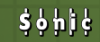

## About the bug

The vertical name exploit essentially is a way to use line-break or new-line characters in your display name ingame. This allows your name to be in multiple lines at once. An example is shown below.


## Discovery

The bug was discovered in late 2019 by **Sonic** and partly featured in this [video](https://www.youtube.com/watch?v=vP55daecQIY). Whilst back then it was not really an "exploit", the devs patched the old method months after it's discovery. It is important to say that the old exploit did not only include the vertical name bug, it also allowed to have multiple characters in the same line, resulting in interesting possible name combinations as shown in the video and in the image below.




## Technical description & timeline

- **2019 - 2020 Summer**: You were able to simply copy paste a new line character into your display name and it showed ingame. (e.g by writing a name in editor over multiple lines and copying it)<br><br>
**Note 1:** The character ```0x0A Carriage Return``` in combination with ```0x0D New Line``` resulted in multiple characters in one line. (shown in the image aboth)

- **2021 - 2022**: This method was fixed when they introduced a **blacklist**, that blacklisted certain characters like the ```0x0D New Line``` from being in your display name. Having those characters in your name would result in a blank name.
This was pretty easy to bypass by using ```0x0B Vertical Tabulation```. At that time another character ```0x03 End of Text``` was found, which still works today. This character forces the display name to be one character each line turning the whole name vertical. However this **ONLY** lets you put 1 character per line. <br>
A while after the discovery of the ```0x03 End of Text``` character the tool [**vertical Display Name Generator**](https://github.com/Sonicbird21/vertical-Username-Zombsroyale) was created.<br><br>
**Note 2:** The character ```0x03 End of Text``` also results in a cutoff of kill messages in the kill feed. (eg. "was killed by Player using..." was cut off and is not shown)

- **2022 - Now**: The ```0x0B Vertical Tabulation``` character was blacklisted pretty quickly. This left us with only the End of text method for months. After trying out different characters featured in Unicode tables, a new character was discovered and added to the Vertical Display Name Generator. It was the character ```0x2028 Line Separator```. Multi-Line Multi-Word Display names were back! This character acted just like a normal New Line character but with 2 bytes instead of 1 which had the unfortunate side effect of the display names' size being limited due to Zombsroyale's serverside kick when a display name exceeded the limit. <br><br>
**Note 3:** It is possible to combine both the ```0x2028 Line Separator``` and the ```0x03 End of Text```. This removes the ability for multiple characters per line. However  this method allows the vertical name to be completely free of additional text as mentioned aboth in Note 2.

## Future of vertical name

The vertical name was patched multiple times in the past for multiple reasons: 
- The characters being leaked
- People overused them in events
- The game actually being "sort of" alive

As of this writing vertical name has been working flawlessly for over 3 years. Considering this, it is very unlikely for the game developers to put efforts into patching this bug anytime in the future. 
