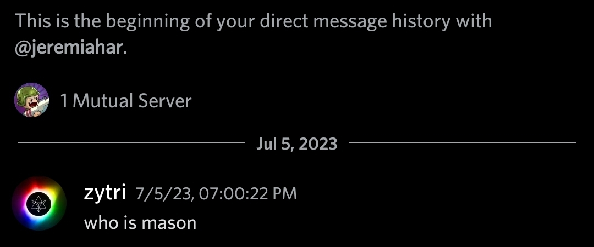

ZombsRoyale's API is split into two components that each handle different things. This is the documentation for the so called "mason" part.

# _Who_ is Mason?

The Mason Service is responsible for handling the friend, ~~clan, messaging~~, party and matchmaking systems.

Mason is based on [Socket.IO](https://socket.io/) and communicates with the game via WebSockets. All supported server-to-client and client-to-server events are well documented.

# Security

The Mason Service is probably the least secure of all ZombsRoyale.io network components. It has a ton of bugs and doesn't even enforce types. All client-to-server messages are capped at 1 million characters and if they exceed that limit, they're not handled.
